# FreSCo
Frequency-Domain Scan Context for Robust LiDAR-based Place Recognition with Translation and Rotation Invariance.

## News
This work is now accepted for ICARCV 2022. 

## 1. Introducing FreSCo
Place recognition is a task expected to recognize a place when revisiting it using data from sensors like Camera or LiDAR. Existing works on hand-crafted global descriptors for LiDAR-based place recognition show remarkable performance, yet are usually viewpoint-dependent. The capibility of viewpoint invariance is important, as when revists occur, one cannot assure the new viewpoint around the same place does not deviate from the former one. 

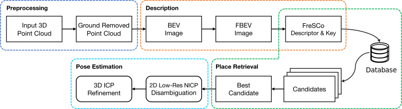

FreSCo is a novel global descriptor inspired by Scan Context and LiDAR Iris, but provides both translation invariance and rotation invariance at the same time. 


## 2. How to Use
### 2.1 Data Preprocessing
Note that we separated the preprocessing part of the code from the project, and users may find more about how to preprocess the data from publicly available datasets (e.g. MulRan, KITTI, and Oxford Radar) at [Point-Cloud-Preprocessing-Tools](https://github.com/soytony/Point-Cloud-Preprocessing-Tools).

### 2.2 Getting Your Data Ready
Make sure the `<keyframes_root_dir>` directory is organized as follows: 
```
<keyframes_root_dir>
├ ... 
├ non_ground_point_cloud/ <- folder for ground-removed point clouds in pcd format
├ output_multi_bev/ <- folder for multi-layer BEV images(NOT used currently)
└ output_single_bev <- folder for single-layer BEV images
```

### 2.3 Run Estimations
Check the `bvm_dir` and `gt_pose_filename` in `./fresco-matlab/test4XXX.m`. 

`XXX` is the sequence name, can be `KASIT03`, `KITTI08` or `Oxford`. 

Make sure they look like this:
```
bvm_dir = '<keyframes_root_dir>/output_single_bev/csv/';
gt_pose_filename = '<keyframes_root_dir>/keyframe_pose.csv';

```
Remember to replace `<keyframes_root_dir>` with the actual directory path.

Now run this script. It first computes the descriptors (if not cached), then computes the similarities, and finally estimate the performance in different threshold settings. 

After the computations are done, it visualizes the retrieval results on the trajectory and shows precision-recall curve. 

## 3. Performance
Details can be found in the paper. 
### 3.1 Precision-Recall
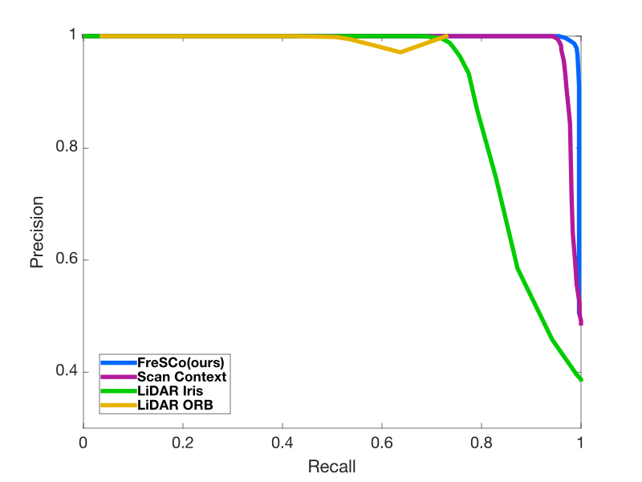 <center style="font-size:14px;color:#808080;font-family:'Helvetica Neue';font-weight:400">MulRan KAIST03</center> | 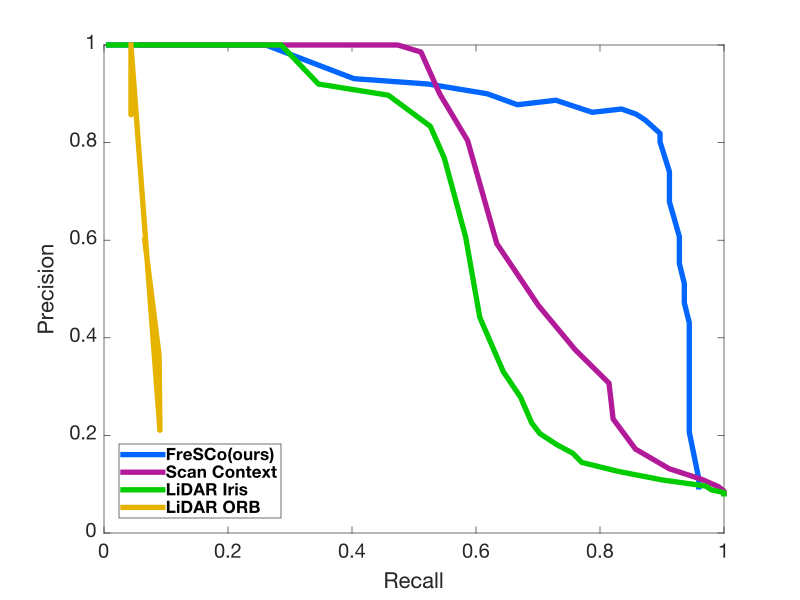 <center style="font-size:14px;color:#808080;font-family:'Helvetica Neue';font-weight:400">KITTI 08</center> | 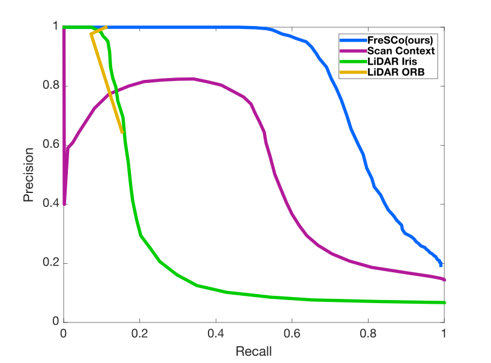 <center style="font-size:14px;color:#808080;font-family:'Helvetica Neue';font-weight:400">Oxford</center>
---|---|---

### 3.2 Visualizations
#### 3.2.1 MulRan KAIST 03

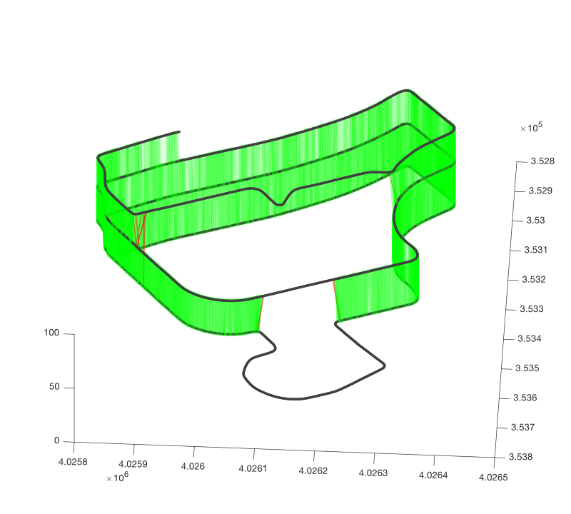 <center style="font-size:14px;color:#808080;font-family:'Helvetica Neue';font-weight:700">FreSCo</center> | 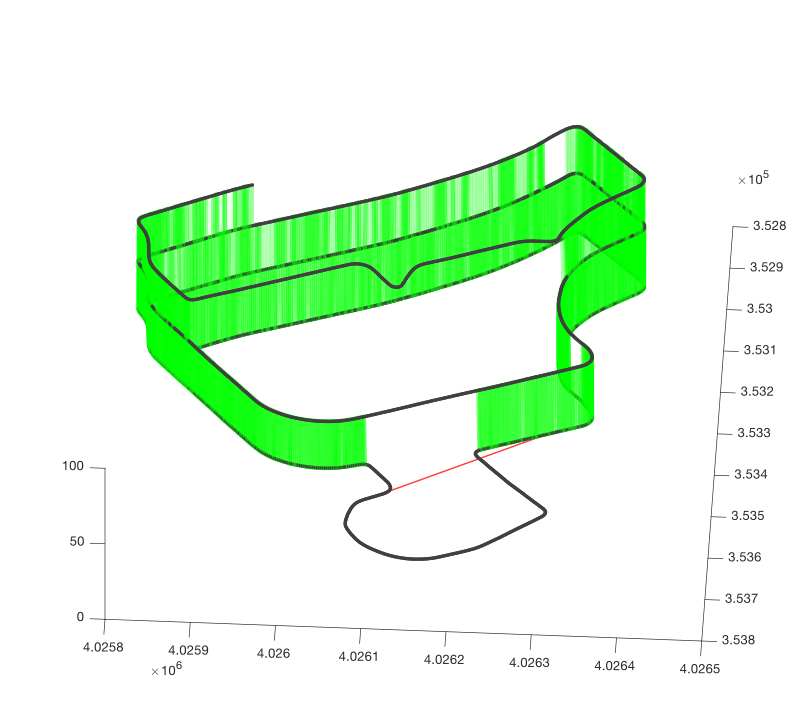 <center style="font-size:14px;color:#808080;font-family:'Helvetica Neue';font-weight:400">Scan Context</center>
---|---

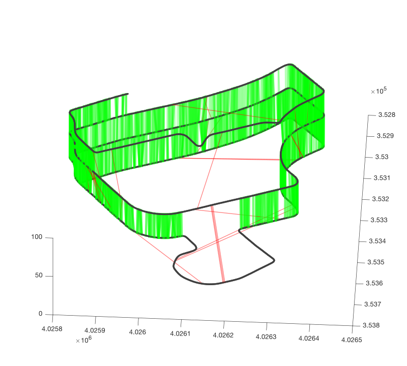 <center style="font-size:14px;color:#808080;font-family:'Helvetica Neue';font-weight:400">LiDAR Iris</center> | 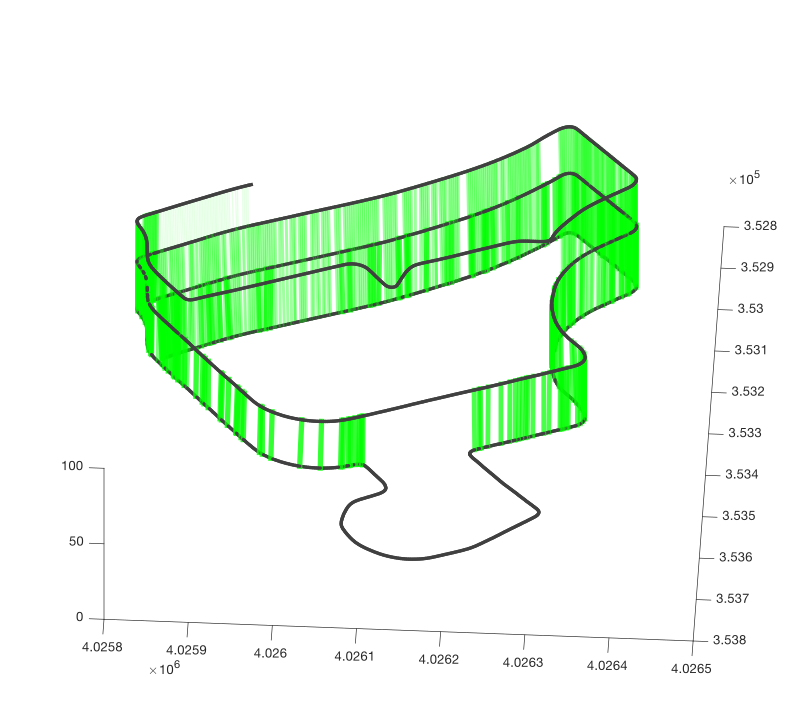 <center style="font-size:14px;color:#808080;font-family:'Helvetica Neue';font-weight:400">LiDAR ORB</center>
---|---

#### 3.2.2 KITTI 08

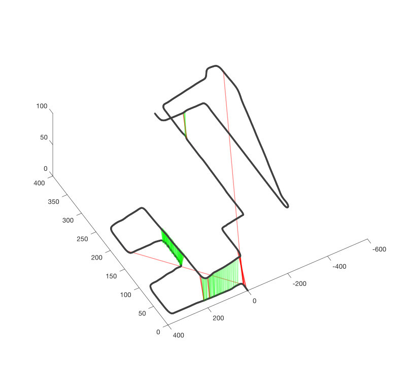 <center style="font-size:14px;color:#808080;font-family:'Helvetica Neue';font-weight:700">FreSCo</center> | 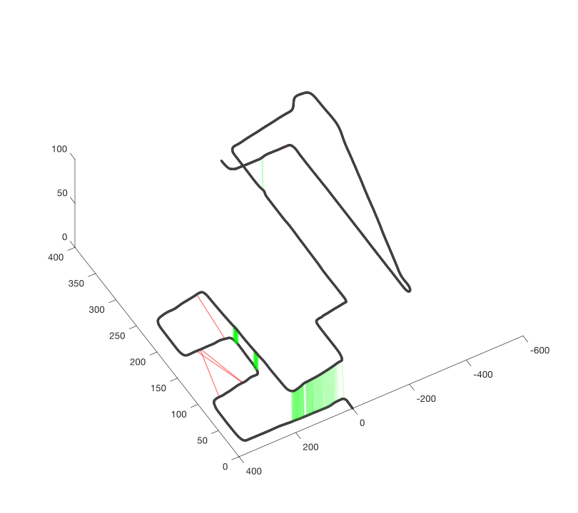 <center style="font-size:14px;color:#808080;font-family:'Helvetica Neue';font-weight:400">Scan Context</center>
---|---

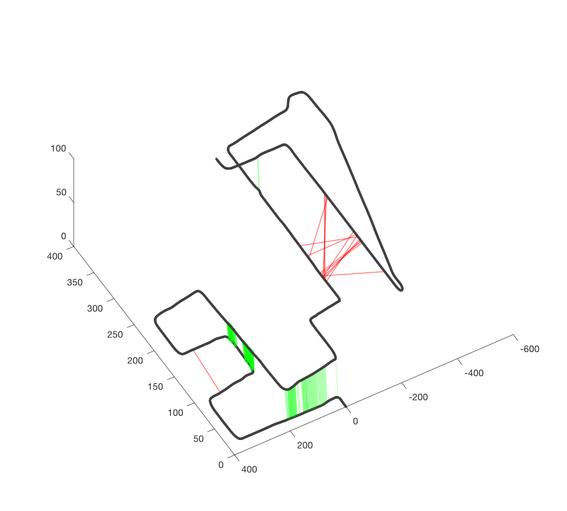 <center style="font-size:14px;color:#808080;font-family:'Helvetica Neue';font-weight:400">LiDAR Iris</center> | 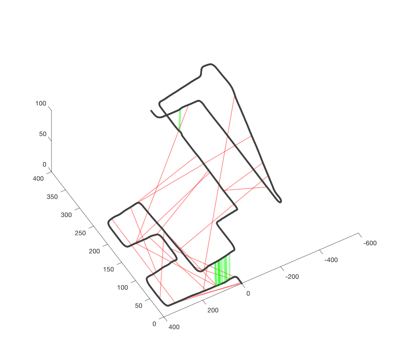 <center style="font-size:14px;color:#808080;font-family:'Helvetica Neue';font-weight:400">LiDAR ORB</center>
---|---

#### 3.2.3 Oxford Robotcar Radar

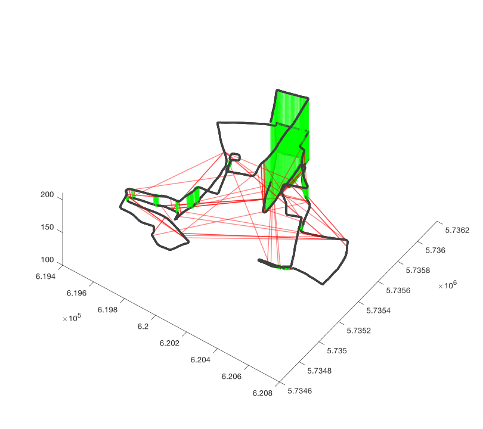 <center style="font-size:14px;color:#808080;font-family:'Helvetica Neue';font-weight:700">FreSCo</center> | 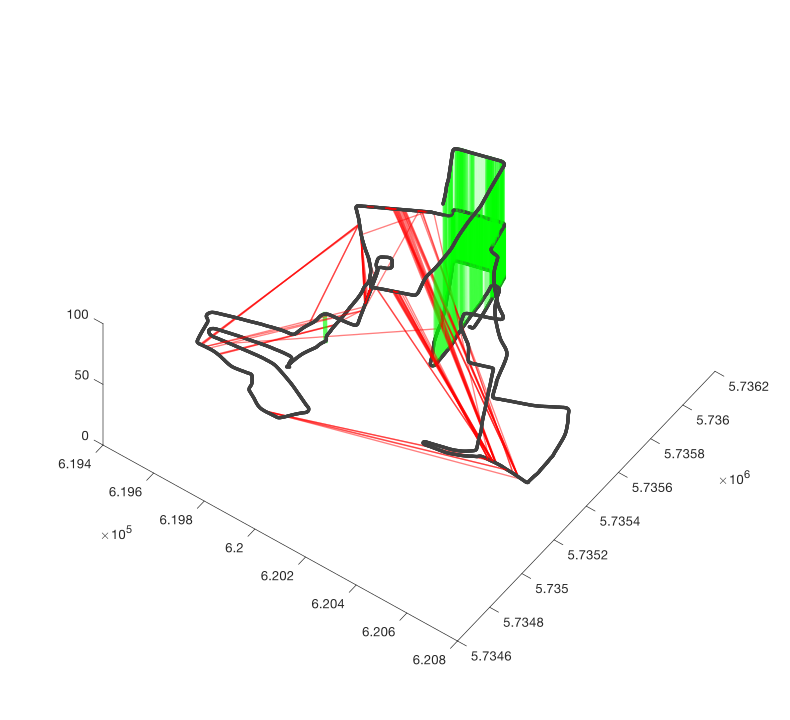 <center style="font-size:14px;color:#808080;font-family:'Helvetica Neue';font-weight:400">Scan Context</center>
---|---

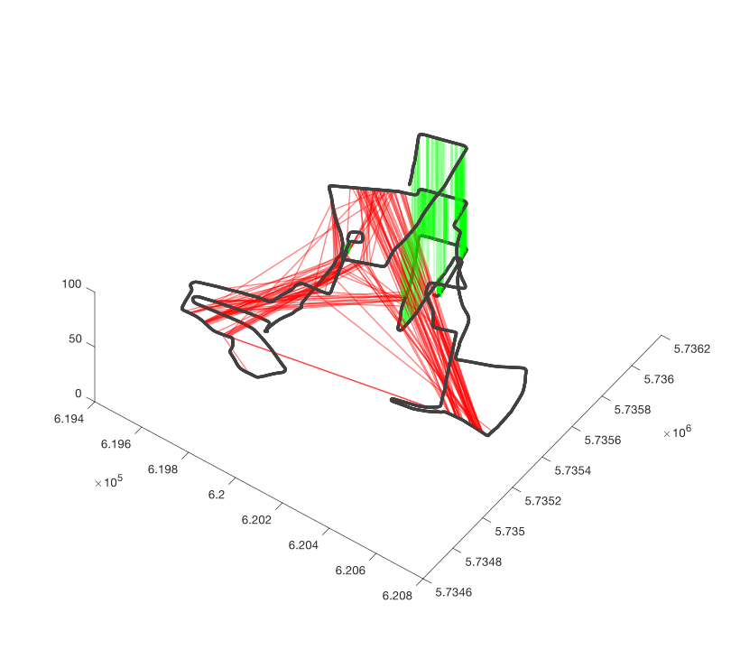 <center style="font-size:14px;color:#808080;font-family:'Helvetica Neue';font-weight:400">LiDAR Iris</center> | 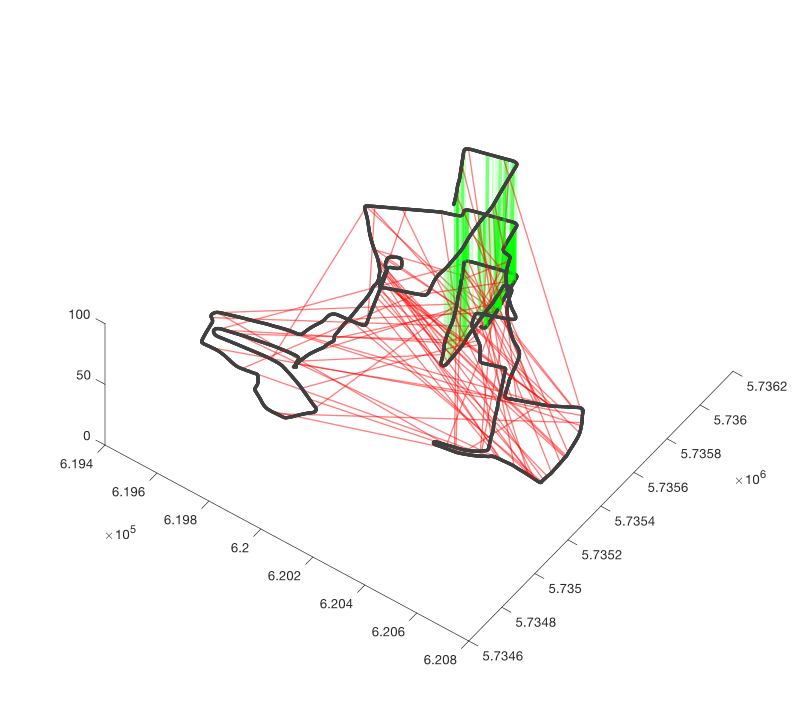 <center style="font-size:14px;color:#808080;font-family:'Helvetica Neue';font-weight:400">LiDAR ORB</center>
---|---

## 4. Publication
If this work is useful to your research, please cite our [paper (PDF)](https://arxiv.org/abs/2206.12628): 
```
@article{fan2022fresco,
  title={FreSCo: Frequency-Domain Scan Context for LiDAR-based Place Recognition with Translation and Rotation Invariance},
  author={Fan, Yongzhi and Du, Xin and Luo, Lun and Shen, Jizhong},
  journal={arXiv preprint arXiv:2206.12628},
  year={2022}
}
```

## 5. TO-DOs
[] Try creating the keys using VALD / NetVLAD;
